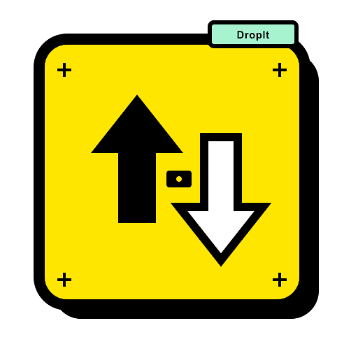

<p align="center">
  
</p>

<h1 align="center">DropIt</h1>

<p align="center">
  <strong>Lightning-Fast, Secure & Zero-Cloud Local File & Folder Sharing</strong><br>
  Built with Python, Flet, and Zero-Install Mobile Web Sharing.
</p>

<p align="center">
  <a href="#-key-features">Features</a> •
  <a href="#-quick-start">Quick Start</a> •
  <a href="#-how-to-use">How to Use</a> •
  <a href="#-performance--telemetry">Telemetry</a> •
  <a href="#-building-executable">Building .EXE</a> •
  <a href="#-github-actions-cicd">CI/CD</a> •
  <a href="#-codebase-architecture">Architecture</a> •
  <a href="#-neo-brutalism-ui">UI Design</a>
</p>

---

## 🌟 Key Features

- **📱 Zero-Install Mobile Web Sharing (QR Code)**:
  - **Upload to PC**: Scan the QR code displayed in Receive Mode with your phone (iOS / Android) to upload files or full folder trees directly to your computer.
  - **Download from PC**: Scan the QR code in Send Mode to download files or auto-zipped folder archives straight to your mobile browser.
- **💻 Passcode-Based PC-to-PC Direct Transfer**: Connect desktop instances instantly using a simple 4-digit passcode or enter a direct IP to bypass campus / enterprise AP isolation.
- **⚡ High-Throughput Network Engine**: Optimized 256 KB socket chunking delivering local transfer speeds up to **200+ MB/s** over 5GHz Wi-Fi and Mobile Hotspots.
- **📊 Dedicated Real-Time Telemetry Dashboard**: Unified `TransferView` tracking live transfer speed, peak speed, transferred bytes, and dynamic ETA calculations.
- **📁 Full Directory Hierarchy Preservation**: Recursively transfer deeply nested directories with automatic relative path reconstruction (`webkitdirectory` & ZIP stream support).
- **🌓 Modern Reactive UI with Light & Dark Modes**: Clean Warm Cream (Light) and Obsidian (Dark) themes powered by **Flet (Flutter for Python)**.
- **📦 Zero-Memory-Footprint Streaming**: Files and folders are streamed in binary chunks directly between socket and disk without loading entire payloads into RAM.
- **🛡️ Universal Browser Compatibility**: Fully supports Chrome, Safari, Brave, Opera, and Firefox with preflight `OPTIONS` and full CORS header compliance.

---

## 🚀 Quick Start

### Prerequisites
- **Python 3.10+** installed on your system.

### Installation

1. **Clone the repository**:
   ```bash
   git clone https://github.com/pansariji/Dropit.git
   cd Dropit
   ```

2. **Install dependencies**:
   ```bash
   pip install -r requirements.txt
   ```

3. **Launch DropIt**:
   ```bash
   python main.py
   ```

---

## 📖 How to Use

### 1. Mobile Sharing via QR Code (Zero-Install)
- **Receive from Mobile:**
  1. Click **Receive** on your PC.
  2. Select the **Mobile (QR)** tab.
  3. Scan the displayed QR code with your smartphone camera.
  4. Select files or folders in your mobile browser to upload directly to your PC's `Downloads/` directory.
- **Send to Mobile:**
  1. Click **Send** on your PC.
  2. Select a file or folder (via button or Drag & Drop).
  3. Switch to the **Mobile (QR)** tab.
  4. Scan the QR code on your phone to initiate a high-speed download (folders are automatically compressed into `.zip` archives on-the-fly).

### 2. PC-to-PC Transfer (Passcode & Direct IP Mode)
- **Receiver PC:**
  1. Click **Receive** > **PC (Passcode)** tab.
  2. Share the generated 4-digit passcode and your local IP with the sender.
- **Sender PC:**
  1. Click **Send**, pick your file or directory, and select **PC (Passcode)**.
  2. Enter the recipient's 4-digit passcode and click **Send Payload**.
  3. *(Optional)* If on restricted Wi-Fi (Enterprise/University), check **Direct IP Entry** to bypass router broadcast blocking.

> 💡 **Troubleshooting Campus / Enterprise Wi-Fi (AP Isolation)**:
> Public, dorm, and enterprise Wi-Fi networks frequently block UDP broadcast device discovery. DropIt effortlessly overcomes this:
> 1. **Direct IP Bypass**: Enable the target IP option on the sender and enter the receiver's IP address directly.
> 2. **Firewall Access**: Ensure Python / DropIt is allowed through your OS firewall for both Private and Public network profiles.

---

## ⚡ Performance & Telemetry

DropIt features a dedicated, unified `TransferView` that activates during any transfer:
- **Instant Visual Feedback**: Animated progress bar and completion percentage.
- **4-Metric Telemetry Panel**:
  - **Current Speed** (`MB/s`)
  - **Peak Transfer Speed** (`MB/s`)
  - **Transferred Bytes / Total Size**
  - **Dynamic Estimated Time Remaining (ETA)**
- **Post-Transfer Actions**: One-click **"Open File Location"** to inspect downloaded files in Windows Explorer, macOS Finder, or Linux file managers.

---

## 📦 Building Standalone Executable (.EXE)

DropIt can be packaged into a standalone desktop executable that runs without requiring Python installed:

### Local Build (Windows)
```bash
pip install -r requirements.txt
pyinstaller --noconfirm --onefile --windowed --icon=assets/logo.ico --add-data "assets;assets" --name DropIt main.py
```
The compiled executable will be located in the `dist/` directory.

### Local Build (macOS / Linux)
```bash
pip install -r requirements.txt
pyinstaller --noconfirm --onefile --windowed --add-data "assets:assets" --name DropIt main.py
```

---

## ⚙️ GitHub Actions CI/CD

DropIt includes an automated multi-platform CI/CD pipeline (`.github/workflows/build.yml`):
- Automatically triggers upon **Releases** or **Workflow Dispatch**.
- Compiles native executables on **Windows**, **macOS**, and **Linux** runners.
- Uploads compiled binaries as release assets directly to GitHub.

---

## 🏗️ Codebase Architecture

```
DropIt/
├── .github/
│   └── workflows/
│       └── build.yml       # Multi-platform CI/CD build matrix (Windows, macOS, Linux)
├── assets/
│   ├── logo.ico            # Desktop application window icon
│   └── logo.png            # High-resolution brand emblem
├── p2p/                    # Direct PC-to-PC P2P Transfer Engine
│   ├── __init__.py
│   ├── client.py           # UDP discovery broadcaster & TCP socket streaming sender
│   └── server.py           # UDP listener, passcode authenticator & TCP socket receiver
├── web/                    # Zero-Install Mobile Web Sharing Engine
│   ├── __init__.py
│   ├── server.py           # DropItHTTPHandler, WebReceiver & WebSender (CORS & zip streaming)
│   └── templates.py        # Embedded responsive mobile HTML5/CSS3/JS interfaces
├── ui/                     # Reactive UI Modules (Flet)
│   ├── __init__.py
│   ├── home_view.py        # Brand dashboard, status pill, theme switch, navigation
│   ├── receive_view.py     # Receive screen (Mobile QR & PC Passcode tabs)
│   ├── send_view.py        # Send screen (File/Folder picker, Drag & Drop, PC & QR modes)
│   └── transfer_view.py    # Dedicated telemetry dashboard & transfer lifecycle controller
├── config.py               # Theme tokens, network ports, chunk sizes & app constants
├── utils.py                # Network resolution, QR generation, metrics tracker & OS helpers
├── main.py                 # Flet application bootstrap, window configuration & view router
├── requirements.txt        # Python dependency manifest (Flet, qrcode, Pillow, PyInstaller)
├── DESIGN.md               # Future UI design specification ("DropIt Utility Brutalism")
├── context.md              # AI agent knowledge base & persistent context reference
├── workflow.md             # Technical networking protocol & architectural specification
└── README.md               # Project overview & documentation
```

---

## 🎨 UI Design: Neo-Brutalism

A comprehensive design specification was created in [`DESIGN.md`](DESIGN.md) and is now fully implemented.
- **Aesthetic**: Industrial Utility Brutalism (Neo-Brutalism).
- **Core Principles**: High contrast ink-black borders (`2px - 3px`), zero-blur kinetic depth (`3px - 4px` hard offset shadows), mechanical button depression (`translate(2px, 2px)`), Space Grotesk typography, and raw tabular telemetry in JetBrains Mono.
- **Target Form Factor**: 460×690px (2:3 aspect ratio) industrial diagnostic handheld terminal geometry.

*Note: The Neo-Brutalism overhaul is fully shipped in this release.*

---

## 📜 License

Distributed under the MIT License. See `LICENSE` for details.
