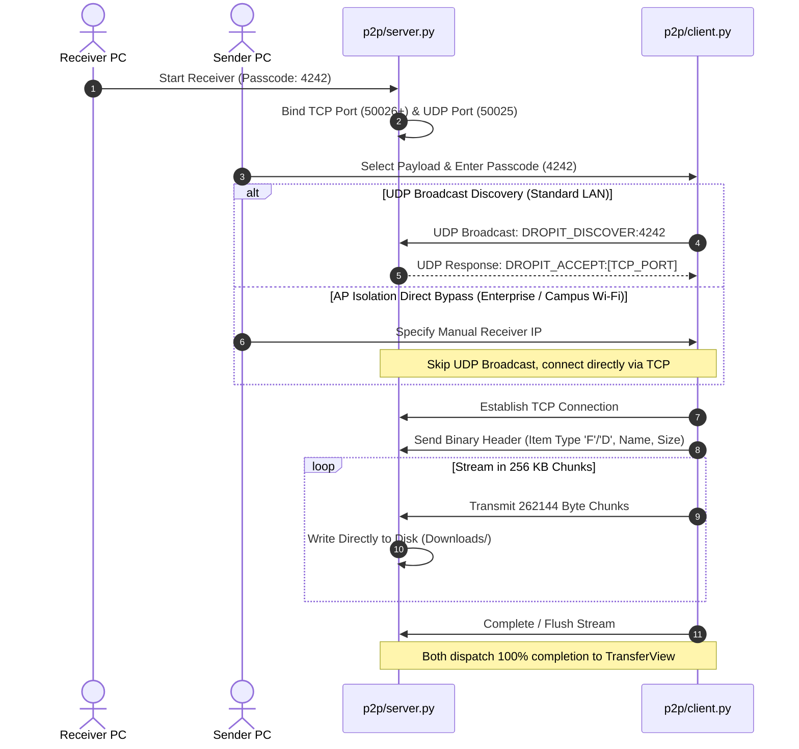
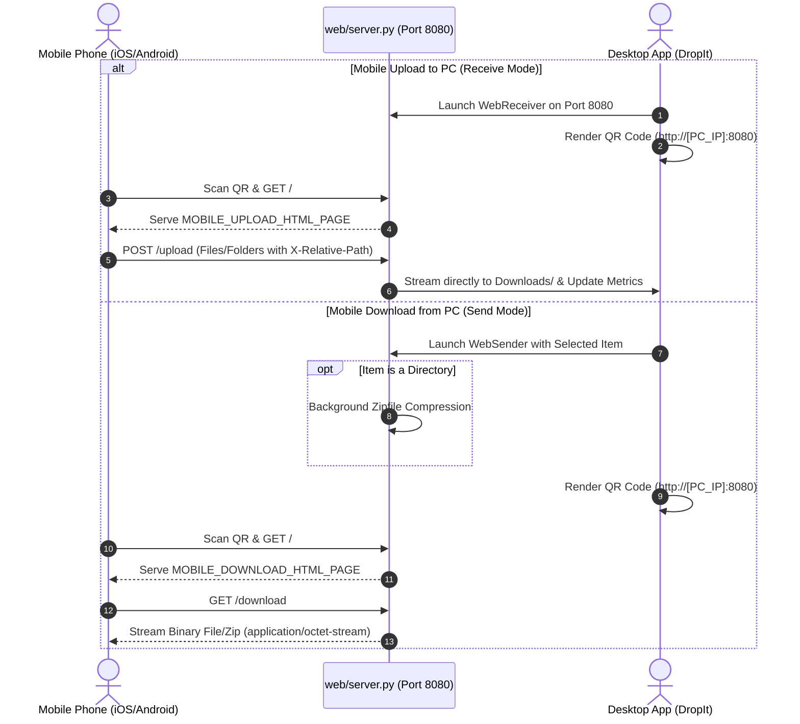
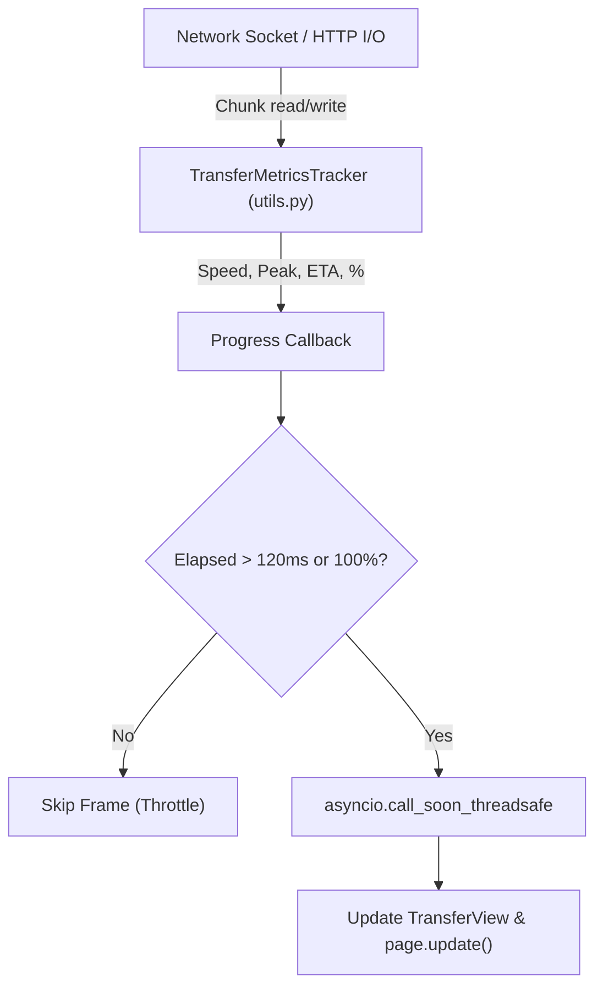

# DropIt Architecture & Networking Workflow Specification

DropIt is a modular, zero-cloud peer-to-peer file and folder sharing application built with Python, Flet (Flutter engine for Python), and native TCP/UDP/HTTP networking. It enables high-speed transfers between computers and mobile devices connected to the same local network without third-party servers, internet access, or external cloud connectivity.

---

## 🏛️ Codebase Module Organization

The application is structured into decoupled, single-responsibility modules:

- **`config.py`**: Central configuration store defining visual tokens (Light & Dark theme palettes), default networking ports (UDP `50025`, P2P `50026`, Web `8080`), buffer chunk sizes (`65536` bytes / 64 KB), versioning (`2.2.0`), and storage paths (`Downloads/`).
- **`utils.py`**: Core utilities:
  - LAN IP auto-detection (`get_local_ip`) via temporary UDP socket probe.
  - 4-digit random numeric passcode generation (`generate_passcode`).
  - Byte size and time duration formatters (`format_size`, `format_time`).
  - QR code rendering into base64 PNGs for Flet image components (`generate_qr_image`, `pil_to_b64`).
  - Cross-platform file manager highlighting (`open_file_location` for Windows, macOS, Linux).
  - High-precision telemetry tracker (`TransferMetricsTracker`) computing instantaneous speed, peak speed, rolling average speed, and dynamic ETA.
  - PyInstaller resource resolver (`get_resource_path`) supporting both dev mode and `sys._MEIPASS` bundles.
- **`p2p/` Package**:
  - **`p2p/client.py`**: P2P Sender engine executing UDP broadcast discovery, direct IP fallback, and binary TCP socket file/folder streaming with directory tree reconstruction.
  - **`p2p/server.py`**: P2P Receiver engine managing UDP discovery responses, passcode validation, TCP socket listeners, and incoming binary stream writes to disk.
- **`web/` Package**:
  - **`web/server.py`**: Embedded HTTP server (`DropItHTTPHandler`, `WebReceiver`, `WebSender`) with universal CORS, OPTIONS preflight compliance, and on-the-fly ZIP compression for mobile folder downloads.
  - **`web/templates.py`**: Responsive mobile HTML5, CSS3, and vanilla JavaScript web apps for zero-install mobile browser uploads and downloads.
- **`ui/` Package**:
  - **`ui/home_view.py`**: Main dashboard with app branding, network readiness indicator, Light/Dark mode toggle, and primary navigation actions.
  - **`ui/receive_view.py`**: Reception management supporting Mobile QR mode (HTTP upload server) and PC Passcode mode (P2P socket receiver).
  - **`ui/send_view.py`**: Send orchestration supporting file and folder selection (via multi-tier native `FilePicker`, macOS Cocoa `NSOpenPanel`, Linux `zenity`/`kdialog`, and Windows Tkinter dialogs), Drag & Drop (Win32 `NativeDropOverlay`, command-line launch drops, drop-zone click), clipboard paste (`PASTE` button and `Ctrl+V` / `Cmd+V`), PC Passcode pairing, and Mobile QR download server.
  - **`ui/transfer_view.py`**: Dedicated, unified telemetry view activated during active transfers, displaying real-time speed, peak speed, ETA, progress bar, cancel options, and post-transfer actions.
- **`main.py`**: Application bootstrap initializing Flet window properties (460×690 2:3 aspect ratio), window icons, theme mode switching, global `Ctrl+V`/`Cmd+V` shortcuts, launch drag-drop argument detection, and view router.
- **`DESIGN.md`**: Architectural specification for the **Utility Neo-Brutalism** design system.
- **`context.md`**: Master context document for AI coding assistants and developers.

---

## 📡 Networking Protocols & Operation Modes

### Mode 1: PC-to-PC Direct Transfer (P2P Passcode Pairing)

This mode executes high-throughput direct laptop-to-laptop transfers using TCP socket streams over local network interfaces.

#### 1. Discovery Phase (UDP Broadcast)
- **Receiver State**: Generates a 4-digit passcode, initializes a dynamic TCP listener on port `50026` (or next free port), and binds a UDP listener on port `50025` (`0.0.0.0:50025`).
- **Sender State**: Transmits a discovery broadcast packet (`DROPIT_DISCOVER:<passcode>`) to both `255.255.255.255` and the local subnet broadcast address (`X.X.X.255`) with up to 5 retry cycles.
- **Validation & Response**: Upon receiving a matching passcode, the receiver transmits `DROPIT_ACCEPT:<tcp_port>` directly back to the sender's IP.

#### 2. Enterprise / Campus Wi-Fi AP Isolation Handling
- In environments where routers block UDP broadcasts and peer discovery (such as universities and offices), users can supply the target IP directly on the sender side.
- DropIt immediately bypasses UDP discovery and connects via unicast TCP.

#### 3. Binary Data Transfer Phase (TCP Socket Stream)
- **Header Serialization**: Uses Python's `struct` module to pack binary framing headers:
  - **Item Flag**: `'F'` for single file, `'D'` for directory hierarchy.
  - **Payload Metadata**: File name length, UTF-8 encoded file name, and total byte size.
  - **Directory Traversal**: For folders, the sender recursively scans relative paths, transmits entry counts, relative directory paths, and individual file chunks.
- **Direct-to-Disk Chunking**: 64 KB (`65536` bytes) chunks stream directly from disk to network socket and back to disk, avoiding high memory buffers.

---

### Mode 2: Mobile Browser Web Sharing (Zero-Install QR Code)

Allows any iOS or Android device on the same Wi-Fi/Hotspot to transfer files using a standard web browser.

#### 1. QR Code Connection
- Resolves the PC's primary LAN IP using a datagram socket check.
- Generates a QR code embedding `http://<PC_IP>:<PORT>`.
- Converts PIL images to Base64 PNGs rendered natively within Flet `ft.Image`.

#### 2. Universal Browser & CORS Compliance
- Handles HTTP preflight `OPTIONS` requests via `do_OPTIONS`.
- Appends permissive CORS headers (`Access-Control-Allow-Origin: *`) and explicit cache-control headers (`no-cache, no-store`) to ensure full compatibility with Safari, Chrome, Brave, and Opera.

#### 3. Mobile Uploads (Web Receiver)
- **Neo-Brutalist Mobile Interface**: Built directly with the desktop app's aesthetic tokens (`#F4F4EE` canvas, `#FFFFFF` card, `2.5px solid #000` border, `4px`/`3px` hard offset shadows, Space Grotesk + JetBrains Mono typography, and mechanical button depression).
- **Client-Side File Staging**: Handles files and folder trees via HTML5 `<input type="file" multiple>` and `<input webkitdirectory>`.
- **4-Grid Real-Time Telemetry HUD**: Replicates the exact desktop `TransferView` HUD directly in the mobile browser:
  - Hero percentage counter and brutalist progress bar with head marker.
  - 4 telemetry tiles: **SIZE** (current / total bytes), **SPEED** (instantaneous throughput highlighted in Hazard Yellow), **PEAK** (maximum recorded rate), and **ETA** (dynamic time remaining).
- **In-Flight Cancellation**: A prominent Safety Red `[✕ CANCEL PAYLOAD]` button:
  - Aborts active client `XMLHttpRequest` socket stream immediately.
  - Dispatches `POST /cancel` to backend server.
  - Server automatically cleans up partial/corrupted files from `Downloads/` and notifies the desktop UI so neither side hangs.
  - Transitions mobile UI to cancelled state with an instant reset action `[ ↺ SELECT NEW PAYLOAD ]`.

#### 4. Mobile Downloads (Web Sender)
- **Single File**: Streamed with `Content-Disposition: attachment` and exact `Content-Length`.
- **Directory**: Compressed in a background thread into a temporary ZIP archive using `zipfile.ZipFile`, allowing one-tap zip download on mobile devices.
- **Neo-Brutalist Landing Page**: Staged payload card with item icon, name, size badge `[ SIZE // TYPE ]`, and a Hazard Yellow `[ 📥 DOWNLOAD ]` button with tactile depression feedback.

---

## ⚡ Real-Time Telemetry & UI Lifecycle Architecture

### 1. Unified `TransferView`
- Both Send and Receive modes transition seamlessly to a unified `TransferView` control upon socket connection.
- Displays file metadata, animated progress bar, status text, and a 4-metric dashboard:
  - **Current Speed**: Rolling byte delta divided by elapsed interval.
  - **Peak Speed**: Highest instantaneous throughput recorded.
  - **Transferred Bytes**: Formatted as `X MB / Y GB`.
  - **Dynamic ETA**: Remaining bytes divided by instantaneous speed, formatted as human-readable time (`mm:ss` or `hh:mm`).

### 2. UI Thread-Safety & Rate Limiting (Throttling)
- Socket I/O runs inside worker threads (`threading.Thread(daemon=True)`).
- Rapid progress updates from 64 KB chunk loops could easily overwhelm the GUI event loop at 90 MB/s (~1400 updates/sec).
- **Throttling Mechanism**: UI updates are gated to a minimum interval of **120 milliseconds** (`time.time() - self._last_ui_update < 0.12`).
- **Thread-Safe Dispatch**: UI mutation routines are scheduled on the main asyncio event loop via `asyncio.get_running_loop().call_soon_threadsafe(...)`.
- **Completion Guarantee**: Transfer completion events (`100.0%`) immediately bypass the throttling gate to guarantee snappy completion states.

### 3. Post-Transfer Actions
- When receiving completes, `TransferView` displays a prominent tactile **"SHOW PAYLOAD"** button.
- Invokes `open_file_location()` in `utils.py`, revealing the saved payload in the OS default Downloads directory:
  - Windows: `explorer /select, <path>`
  - macOS: `open -R <path>`
  - Linux: `xdg-open <parent_directory>`

### 4. TCP Stream Pause & Resume Architecture
- Both TCP socket stream transfers and Web HTTP stream transfers support real-time pausing with zero button lag or sticking:
  - `p2p/client.py`, `p2p/server.py`, and `web/server.py` employ a `threading.Event()` called `pause_event`.
  - During stream chunk loops, threads evaluate `self.pause_event.wait(timeout=0.2)`. The 200ms timeout ensures threads wake periodically to evaluate `self.running`, preventing deadlocks if cancelled during pause.
  - When the user presses `PAUSE TRANSFER`, the event is cleared (`clear()`), freezing byte streaming while keeping the TCP socket connection and network buffers open. `TransferMetricsTracker.pause()` records the pause start timestamp.
  - When the user presses `RESUME TRANSFER`, the event is set (`set()`), immediately resuming chunk reads/writes. `TransferMetricsTracker.resume()` aggregates `total_paused_time` and resets `last_update_time`, ensuring instantaneous speed, average speed, and ETAs are never distorted by the pause duration.
  - **Zero-Rebuild Persistent Controls**: Action buttons (`pause_btn`, `cancel_btn`) are constructed once upon entering the transfer state and remain persistent in the widget tree. Progress updates mutate only the progress HUD and telemetry, eliminating control recreation during streaming (preventing pointer-up aborts and dropped clicks).
  - **In-Place State Toggling**: Toggling pause mutates `self.pause_icon.icon`, `self.pause_text.value`, and container colors in-place, dispatching an immediate `self.update()` with 0ms latency.
  - **Mechanical Non-Sticking Guarantee**: `utils.make_tactile(...)` wraps button clicks with a `finally:` block that unconditionally resets `container.offset = ft.Offset(0, 0)` and clears `is_animating = False`, guaranteeing the button can never remain visually stuck down.

---

## 🎨 Active UI Architecture: DropIt Utility Brutalism

The application has implemented the **"DropIt Utility Brutalism"** design system specified in [`DESIGN.md`](DESIGN.md) and designed in Stitch MCP:

### Visual Paradigm & Principles:
- **Geometry**: Absolute right angles with zero border radius (`border-radius: 0px`) across all interactive and layout elements.
- **Depth**: Planar hard-edge ink-black offset shadows (`3px 3px 0px #000000` on cards, `4px 4px 0px #000000` on primary CTAs, and `2px 2px 0px #000000` on badges).
- **Kinetic Feedback & Mechanical Button Depress**:
  - `utils.make_tactile(...)` wraps Flet containers with animated translation and shadow collapse.
  - When clicked, buttons depress into the canvas (shadow drops from `(3, 3)` or `(4, 4)` down to `(1, 1)`, offset shifts by `(0.007, 0.018)`).
  - A 50ms async event-loop pause allows the tactile depression to register visually before springing the button back up to its idle resting state and firing callbacks directly on Flet's event loop (instant 1-click execution).
- **Cool Terminal Nomenclature**:
  - Replaces all legacy "file" user-facing wording with the technical standard **"Payload"** (`SEND PAYLOAD`, `RECEIVE PAYLOAD`, `BROWSE PAYLOAD`, `SHOW PAYLOAD`, `STAGE A PAYLOAD`).
- **Color Strategy**: Flat opaque industrial signals (Electric Hazard Yellow `#FFE600`, Cobalt `#2563EB`, Neo Mint `#00F090`, Safety Red `#FF5555`, Cyan `#58E1FF`).
- **Typography**: Dual-font engine pairing `Space Grotesk` (bold geometric headers) with `JetBrains Mono` (tabular lining figures for telemetry, IPs, and byte sizes).
- **Window Frame & Zero-Scroll Policy**: 460×690px (exact 2:3 aspect ratio) compact industrial diagnostic terminal format. All internal view components are proportioned so that zero vertical or horizontal scrolling occurs anywhere in the app.
- **Brand Identity & Titlebars**:
  - Authentic Stitch Neo-Brutalist emblem (DropIt Tag, Screen `6cf36bc30653446d9a5623f44fd1373a`) deployed to window icons, hero cards (120×120px display), and mobile web clients.
  - Sits directly in top titlebars as a clean 26×26 standalone logo without an enclosing yellow box container or black border wrapper.
- **Symmetrical Mode Switcher Tabs**:
  - Active Tab: Hazard Yellow (`#FFE600`) background, `#000000` text & icon, 2px solid ink-black border, and `(2, 2)` hard offset shadow.
  - Inactive Tab: Surface Card (`tokens["card"]`) background, `tokens["muted"]` text & icon, 1.5px border, and `shadow = None`.
  - `make_tactile` checks `container.shadow is not None`, preventing flat/shadowless controls from gaining unwanted shadows upon click.

---

## ⚙️ Multi-Platform CI/CD Build Pipeline

DropIt utilizes GitHub Actions (`.github/workflows/build.yml`) for automated multi-platform compilation:
- **Build Matrix**: Windows Server 2022 (`DropIt-Windows.exe`), macOS Latest (`DropIt-macOS`), and Ubuntu Latest (`DropIt-Linux`).
- **PyInstaller Packaging**:
  - Windows: `pyinstaller --noconfirm --onefile --windowed --icon=assets/logo.ico --add-data "assets;assets" --name DropIt main.py`
  - macOS / Linux: `pyinstaller --noconfirm --onefile --windowed --add-data "assets:assets" --name DropIt main.py`
- **Asset Release**: Compiled binaries are automatically bundled and attached to GitHub Releases.